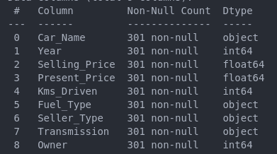

# new-car
 
## Manipulation des données

Au départ, notre base de donnée était de la sorte :

Selling et Present Price n'avaient pas l'air à l'échelle, nous l'avons donc multiplié par 1000 pour avoir des prix plus cohérents avec le marché (ex : de 4.43€ => 4430€).
Nous avons prit la décision de regrouper les données de sorte à les "Classifiers".

Fuel possède trois classes :
- '0'correspond à Pétrol 
- '1'correspond à Diesel 
- '2'correspond à CNG 

Seller possède deux classes :
- '0'correspond à Dealer
- '1'correspond à Individual

Transmission possède deux classes :
- '0'correspond à Manual
- '1'correspond à Automatic 

## Veille sur la régression linéaire

C’est une méthode utilisée pour prédire une valeur (par exemple un prix ou un score) à partir d’autres informations.
Exemple : prédire le prix d’une voiture en fonction de son âge, son kilométrage, etc.

On trace une droite qui passe le plus près possible des points de données.
L’idée, c’est de trouver la meilleure droite qui relie les informations disponibles à la valeur qu’on cherche à estimer.

Utile pour : 
- Quand on veut comprendre un lien entre deux choses
- Quand on a des données chiffrées (prix, nombre, âge, etc.)
- Quand on veut prévoir une valeur à partir de plusieurs critères

Cependant : 
- Ça marche bien si le lien entre les données est assez simple
- Si les données sont trop brouillonnes, la méthode peut être moins efficace